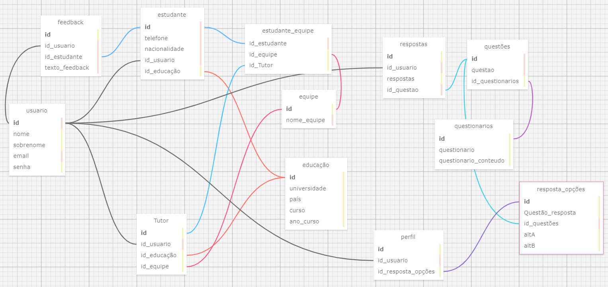

# Ponderada da semana 03 de programação

## Modelo relacional de banco de dados

#### by: Laura de Araujo Rodrigues

&nbsp;&nbsp;&nbsp;&nbsp;Fazer um modelo relacional de banco de dados na construção de software ou aplicação web é essencial por diversas razões. Primeiramente, proporciona uma organização estruturada dos dados em tabelas relacionadas, facilitando a gestão e compreensão do sistema. Além disso, garante a integridade referencial dos dados, prevenindo problemas como registros órfãos e mantendo a consistência das relações entre as informações. A flexibilidade do modelo permite adaptações conforme os requisitos evoluem, enquanto a normalização contribui para a eficiência e manutenção do banco de dados, eliminando redundâncias e inconsistências. Com isso, o modelo relacional oferece melhor desempenho às consultas, ao mesmo tempo em que possibilita implementar medidas de segurança granulares, controlando o acesso aos dados de forma precisa. Em suma, o modelo relacional proporciona uma base sólida e organizada para o armazenamento e gerenciamento de dados, garantindo integridade, flexibilidade, desempenho e segurança ao sistema.

&nbsp;&nbsp;&nbsp;&nbsp;Em vista disso, foi feito na ferramenta sql design um modelo relacional individual com base no entendimento do projeto e dos wireframes projetados pelo grupo.

<div align="center">
  <sub>Figura 01 - Modelo relacional </sub>
  
  <sup>Fonte: Elaborado pelo autor (2024)</sup>
</div>


**Tabela usuário**: para armazenar as informações de qualquer usuário da plataforma inseridos na hora do cadastro. POr isso possui atributos como id, nome, sobrenome, email e senha. O id desta tabela é chave primária em outras 5 tabelas. São elas: Estudante (1:1), tutor (1:1), feedback (N:1), respostas (N:1), perfil(1:1).

**Tabela estudante**: guardar os dados que se identificam como estudante, para que possa coletar outros dados além do de usuário. Atributos: id, telefone, nacionalidade, id_usuario (chave estrangeira), id_educação (chave estrangeira). O id desta tabela é chave primária em feedback (N:1) e estudante_equipe (1:N).

**Tabela tutor**: armazenar dados de usuarios que se identificam como tutor, permitindo que ela tenha acesso a outras telas, visto que ela pode ter mais de um time. Atributos: id, id_usuario(chave estrangeira), id_estudante (chave estrangeira), texto_feedback. 

**Tabela educação**: os participantes do jogo possuem dados educacionais, então essa tabela é importante para organização das informações no banco. Atributos: id, universidade, país, curso, ano_curso. O id desta tabela é chave primária das tabelas estudante (1:1) e tutor (1:1).

**Tabela Equipe**: esta tabela organiza os times que estão no jogo, permitindo que os tutores tenham ligação com seus respectivos times. Atributos: id e nome_equipe. Id é chave primária na tabela tutor (1:N) e estudante_equipe (N:1).

**Tabela estudante_equipe**:Usada como tabela intermediaria entre estudante e equipe, ela serve pra ajudar a relacionar cada estudante como seu respectivo time. Atributos: id_estudante, id_equipe, id_Tutor.

**Tabela questionarios**: armazenar os questinários que tem que ser aplicados nos usuários para coletar dados sobre seu perfil e jogo. Atributos: id, questionario, questionario_conteudo. Id nesta tabela é chave primária na tabela questões (N:1).

**Tabela questões**: armazenar as questões dos questionários. Atributos: id, questao, id_questionarios. O id desta tabela é chave primária das tabelas respostas(1:1) e resposta_opções(1:N).

**Tabela resposta_opções**: alternativas de resposta que contem disponíveis para questões nos questionarios. Atributos: id, questão_resposta, id_questões (chave estrangeira), altA, altB. o id desta tabela é chave primária da tabela perfil (N:1).

**Tabela respostas**: armazenar as respostas das perguntas. Atributos: id, id_usuario, respostas, id_questão (chave estrangeira).

**Tabela feedbacks**: armazenar o feedback escrito pelo usuario para seu colega de equipe ou professor. Atributos: id, id_usuario(chave estrangeira), id_estudante(chave etrangeira), texto_feedback.

**Tabela perfil**: perfil gerado a partir dos questionarios que geram o estilo decision making. Atributos: id, id_usuario (chave estrangeira), id_resposta_opções (chave estrangeira).

## SQL gerado pela ferramenta 

```-- ---
-- Globals
-- ---

-- SET SQL_MODE="NO_AUTO_VALUE_ON_ZERO";
-- SET FOREIGN_KEY_CHECKS=0;

-- ---
-- Table 'equipe'
-- 
-- ---

DROP TABLE IF EXISTS `equipe`;
		
CREATE TABLE `equipe` (
  `id` INTEGER NULL AUTO_INCREMENT DEFAULT NULL,
  `nome_equipe` MEDIUMTEXT NULL DEFAULT NULL,
  PRIMARY KEY (`id`)
);

-- ---
-- Table 'Tutor'
-- 
-- ---

DROP TABLE IF EXISTS `Tutor`;
		
CREATE TABLE `Tutor` (
  `id` INTEGER NULL AUTO_INCREMENT DEFAULT NULL,
  `id_usuario` MEDIUMTEXT NULL DEFAULT NULL,
  `id_educação` INTEGER NULL DEFAULT NULL,
  `id_Team` INTEGER NULL DEFAULT NULL,
  PRIMARY KEY (`id`)
);

-- ---
-- Table 'estudante'
-- 
-- ---

DROP TABLE IF EXISTS `estudante`;
		
CREATE TABLE `estudante` (
  `id` MEDIUMTEXT NULL AUTO_INCREMENT DEFAULT NULL,
  `telefone` MEDIUMTEXT NULL DEFAULT NULL,
  `nacionalidade` MEDIUMTEXT NULL DEFAULT NULL,
  `id_usuario` MEDIUMTEXT NULL DEFAULT NULL,
  `id_educação` INTEGER NULL DEFAULT NULL,
  PRIMARY KEY (`id`)
);

-- ---
-- Table 'usuario'
-- 
-- ---

DROP TABLE IF EXISTS `usuario`;
		
CREATE TABLE `usuario` (
  `id` MEDIUMTEXT NULL AUTO_INCREMENT DEFAULT NULL,
  `nome` INTEGER NULL DEFAULT NULL,
  `sobrenome` INTEGER NULL DEFAULT NULL,
  `email` MEDIUMTEXT NULL DEFAULT NULL,
  `senha` INTEGER NULL DEFAULT NULL,
  PRIMARY KEY (`id`)
);

-- ---
-- Table 'questões'
-- 
-- ---

DROP TABLE IF EXISTS `questões`;
		
CREATE TABLE `questões` (
  `id` MEDIUMTEXT NULL AUTO_INCREMENT DEFAULT NULL,
  `questao` MEDIUMTEXT NULL DEFAULT NULL,
  `id_questionarios` INTEGER NULL DEFAULT NULL,
  PRIMARY KEY (`id`)
);

-- ---
-- Table 'questionarios'
-- 
-- ---

DROP TABLE IF EXISTS `questionarios`;
		
CREATE TABLE `questionarios` (
  `id` INTEGER NULL AUTO_INCREMENT DEFAULT NULL,
  `questionario` INTEGER NULL DEFAULT NULL,
  `questionario_conteudo` INTEGER NULL DEFAULT NULL,
  PRIMARY KEY (`id`)
);

-- ---
-- Table 'educação'
-- 
-- ---

DROP TABLE IF EXISTS `educação`;
		
CREATE TABLE `educação` (
  `id` INTEGER NULL AUTO_INCREMENT DEFAULT NULL,
  `universidade` INTEGER NULL DEFAULT NULL,
  `país` INTEGER NULL DEFAULT NULL,
  `curso` INTEGER NULL DEFAULT NULL,
  `ano_curso` INTEGER NULL DEFAULT NULL,
  PRIMARY KEY (`id`)
);

-- ---
-- Table 'estudante_equipe'
-- 
-- ---

DROP TABLE IF EXISTS `estudante_equipe`;
		
CREATE TABLE `estudante_equipe` (
  `id_estudante` MEDIUMTEXT NULL DEFAULT NULL,
  `id_equipe` INTEGER NULL DEFAULT NULL,
  `id_Tutor` INTEGER NULL DEFAULT NULL,
  PRIMARY KEY ()
);

-- ---
-- Table 'resposta_opções'
-- 
-- ---

DROP TABLE IF EXISTS `resposta_opções`;
		
CREATE TABLE `resposta_opções` (
  `id` INTEGER NULL AUTO_INCREMENT DEFAULT NULL,
  `Questão_resposta` INTEGER NULL DEFAULT NULL,
  `id_questões` MEDIUMTEXT NULL DEFAULT NULL,
  `altA` INTEGER NULL DEFAULT NULL,
  `altB` INTEGER NULL DEFAULT NULL,
  PRIMARY KEY (`id`)
);

-- ---
-- Table 'respostas'
-- 
-- ---

DROP TABLE IF EXISTS `respostas`;
		
CREATE TABLE `respostas` (
  `id` INTEGER NULL AUTO_INCREMENT DEFAULT NULL,
  `id_usuario` MEDIUMTEXT NULL DEFAULT NULL,
  `respostas` INTEGER NULL DEFAULT NULL,
  `id_questao` MEDIUMTEXT NULL DEFAULT NULL,
  PRIMARY KEY (`id`)
);

-- ---
-- Table 'feedback'
-- 
-- ---

DROP TABLE IF EXISTS `feedback`;
		
CREATE TABLE `feedback` (
  `id` INTEGER NULL AUTO_INCREMENT DEFAULT NULL,
  `id_usuario` MEDIUMTEXT NULL DEFAULT NULL,
  `id_estudante` MEDIUMTEXT NULL DEFAULT NULL,
  `texto_feedback` CHAR NULL DEFAULT NULL,
  PRIMARY KEY (`id`)
);

-- ---
-- Table 'perfil'
-- 
-- ---

DROP TABLE IF EXISTS `perfil`;
		
CREATE TABLE `perfil` (
  `id` INTEGER NULL AUTO_INCREMENT DEFAULT NULL,
  `id_usuario` MEDIUMTEXT NULL DEFAULT NULL,
  `id_resposta_opções` INTEGER NULL DEFAULT NULL,
  PRIMARY KEY (`id`)
);

-- ---
-- Foreign Keys 
-- ---

ALTER TABLE `Tutor` ADD FOREIGN KEY (id_usuario) REFERENCES `usuario` (`id`);
ALTER TABLE `Tutor` ADD FOREIGN KEY (id_educação) REFERENCES `educação` (`id`);
ALTER TABLE `Tutor` ADD FOREIGN KEY (id_Team) REFERENCES `equipe` (`id`);
ALTER TABLE `estudante` ADD FOREIGN KEY (id_usuario) REFERENCES `usuario` (`id`);
ALTER TABLE `estudante` ADD FOREIGN KEY (id_educação) REFERENCES `educação` (`id`);
ALTER TABLE `questões` ADD FOREIGN KEY (id_questionarios) REFERENCES `questionarios` (`id`);
ALTER TABLE `estudante_equipe` ADD FOREIGN KEY (id_estudante) REFERENCES `estudante` (`id`);
ALTER TABLE `estudante_equipe` ADD FOREIGN KEY (id_equipe) REFERENCES `equipe` (`id`);
ALTER TABLE `estudante_equipe` ADD FOREIGN KEY (id_Tutor) REFERENCES `Tutor` (`id`);
ALTER TABLE `resposta_opções` ADD FOREIGN KEY (id_questões) REFERENCES `questões` (`id`);
ALTER TABLE `respostas` ADD FOREIGN KEY (id_usuario) REFERENCES `usuario` (`id`);
ALTER TABLE `respostas` ADD FOREIGN KEY (id_questao) REFERENCES `questões` (`id`);
ALTER TABLE `feedback` ADD FOREIGN KEY (id_usuario) REFERENCES `usuario` (`id`);
ALTER TABLE `feedback` ADD FOREIGN KEY (id_estudante) REFERENCES `estudante` (`id`);
ALTER TABLE `perfil` ADD FOREIGN KEY (id_usuario) REFERENCES `usuario` (`id`);
ALTER TABLE `perfil` ADD FOREIGN KEY (id_resposta_opções) REFERENCES `resposta_opções` (`id`);

-- ---
-- Table Properties
-- ---

-- ALTER TABLE `equipe` ENGINE=InnoDB DEFAULT CHARSET=utf8 COLLATE=utf8_bin;
-- ALTER TABLE `Tutor` ENGINE=InnoDB DEFAULT CHARSET=utf8 COLLATE=utf8_bin;
-- ALTER TABLE `estudante` ENGINE=InnoDB DEFAULT CHARSET=utf8 COLLATE=utf8_bin;
-- ALTER TABLE `usuario` ENGINE=InnoDB DEFAULT CHARSET=utf8 COLLATE=utf8_bin;
-- ALTER TABLE `questões` ENGINE=InnoDB DEFAULT CHARSET=utf8 COLLATE=utf8_bin;
-- ALTER TABLE `questionarios` ENGINE=InnoDB DEFAULT CHARSET=utf8 COLLATE=utf8_bin;
-- ALTER TABLE `educação` ENGINE=InnoDB DEFAULT CHARSET=utf8 COLLATE=utf8_bin;
-- ALTER TABLE `estudante_equipe` ENGINE=InnoDB DEFAULT CHARSET=utf8 COLLATE=utf8_bin;
-- ALTER TABLE `resposta_opções` ENGINE=InnoDB DEFAULT CHARSET=utf8 COLLATE=utf8_bin;
-- ALTER TABLE `respostas` ENGINE=InnoDB DEFAULT CHARSET=utf8 COLLATE=utf8_bin;
-- ALTER TABLE `feedback` ENGINE=InnoDB DEFAULT CHARSET=utf8 COLLATE=utf8_bin;
-- ALTER TABLE `perfil` ENGINE=InnoDB DEFAULT CHARSET=utf8 COLLATE=utf8_bin;

-- ---
-- Test Data
-- ---

-- INSERT INTO `equipe` (`id`,`nome_equipe`) VALUES
-- ('','');
-- INSERT INTO `Tutor` (`id`,`id_usuario`,`id_educação`,`id_Team`) VALUES
-- ('','','','');
-- INSERT INTO `estudante` (`id`,`telefone`,`nacionalidade`,`id_usuario`,`id_educação`) VALUES
-- ('','','','','');
-- INSERT INTO `usuario` (`id`,`nome`,`sobrenome`,`email`,`senha`) VALUES
-- ('','','','','');
-- INSERT INTO `questões` (`id`,`questao`,`id_questionarios`) VALUES
-- ('','','');
-- INSERT INTO `questionarios` (`id`,`questionario`,`questionario_conteudo`) VALUES
-- ('','','');
-- INSERT INTO `educação` (`id`,`universidade`,`país`,`curso`,`ano_curso`) VALUES
-- ('','','','','');
-- INSERT INTO `estudante_equipe` (`id_estudante`,`id_equipe`,`id_Tutor`) VALUES
-- ('','','');
-- INSERT INTO `resposta_opções` (`id`,`Questão_resposta`,`id_questões`,`altA`,`altB`) VALUES
-- ('','','','','');
-- INSERT INTO `respostas` (`id`,`id_usuario`,`respostas`,`id_questao`) VALUES
-- ('','','','');
-- INSERT INTO `feedback` (`id`,`id_usuario`,`id_estudante`,`texto_feedback`) VALUES
-- ('','','','');
-- INSERT INTO `perfil` (`id`,`id_usuario`,`id_resposta_opções`) VALUES
-- ('','','');

````

## XML gerado pela ferramenta 

```
<?xml version="1.0" encoding="utf-8" ?>
<!-- SQL XML created by WWW SQL Designer, https://github.com/ondras/wwwsqldesigner/ -->
<!-- Active URL: https://sql.toad.cz/ -->
<sql>
<datatypes db="mysql">
	<group label="Numeric" color="rgb(238,238,170)">
		<type label="Integer" length="0" sql="INTEGER" quote=""/>
	 	<type label="TINYINT" length="0" sql="TINYINT" quote=""/>
	 	<type label="SMALLINT" length="0" sql="SMALLINT" quote=""/>
	 	<type label="MEDIUMINT" length="0" sql="MEDIUMINT" quote=""/>
	 	<type label="INT" length="0" sql="INT" quote=""/>
		<type label="BIGINT" length="0" sql="BIGINT" quote=""/>
		<type label="Decimal" length="1" sql="DECIMAL" re="DEC" quote=""/>
		<type label="Single precision" length="0" sql="FLOAT" quote=""/>
		<type label="Double precision" length="0" sql="DOUBLE" re="DOUBLE" quote=""/>
	</group>

	<group label="Character" color="rgb(255,200,200)">
		<type label="Char" length="1" sql="CHAR" quote="'"/>
		<type label="Varchar" length="1" sql="VARCHAR" quote="'"/>
		<type label="Text" length="0" sql="MEDIUMTEXT" re="TEXT" quote="'"/>
		<type label="Binary" length="1" sql="BINARY" quote="'"/>
		<type label="Varbinary" length="1" sql="VARBINARY" quote="'"/>
		<type label="BLOB" length="0" sql="BLOB" re="BLOB" quote="'"/>
	</group>

	<group label="Date &amp; Time" color="rgb(200,255,200)">
		<type label="Date" length="0" sql="DATE" quote="'"/>
		<type label="Time" length="0" sql="TIME" quote="'"/>
		<type label="Datetime" length="0" sql="DATETIME" quote="'"/>
		<type label="Year" length="0" sql="YEAR" quote=""/>
		<type label="Timestamp" length="0" sql="TIMESTAMP" quote="'"/>
	</group>
	
	<group label="Miscellaneous" color="rgb(200,200,255)">
		<type label="ENUM" length="1" sql="ENUM" quote=""/>
		<type label="SET" length="1" sql="SET" quote=""/>
		<type label="Bit" length="0" sql="bit" quote=""/>
	</group>
</datatypes><table x="904" y="229" name="equipe">
<row name="id" null="1" autoincrement="1">
<datatype>INTEGER</datatype>
<default>NULL</default></row>
<row name="nome_equipe" null="1" autoincrement="0">
<datatype>MEDIUMTEXT</datatype>
<default>NULL</default></row>
<key type="PRIMARY" name="">
<part>id</part>
</key>
</table>
<table x="600" y="489" name="Tutor">
<row name="id" null="1" autoincrement="1">
<datatype>INTEGER</datatype>
<default>NULL</default></row>
<row name="id_usuario" null="1" autoincrement="0">
<datatype>MEDIUMTEXT</datatype>
<default>NULL</default><relation table="usuario" row="id" />
</row>
<row name="id_educação" null="1" autoincrement="0">
<datatype>INTEGER</datatype>
<default>NULL</default><relation table="educação" row="id" />
</row>
<row name="id_Team" null="1" autoincrement="0">
<datatype>INTEGER</datatype>
<default>NULL</default><relation table="equipe" row="id" />
</row>
<key type="PRIMARY" name="">
<part>id</part>
</key>
</table>
<table x="608" y="57" name="estudante">
<row name="id" null="1" autoincrement="1">
<datatype>MEDIUMTEXT</datatype>
<default>NULL</default></row>
<row name="telefone" null="1" autoincrement="0">
<datatype>MEDIUMTEXT</datatype>
<default>NULL</default></row>
<row name="nacionalidade" null="1" autoincrement="0">
<datatype>MEDIUMTEXT</datatype>
<default>NULL</default></row>
<row name="id_usuario" null="1" autoincrement="0">
<datatype>MEDIUMTEXT</datatype>
<default>NULL</default><relation table="usuario" row="id" />
</row>
<row name="id_educação" null="1" autoincrement="0">
<datatype>INTEGER</datatype>
<default>NULL</default><relation table="educação" row="id" />
</row>
<key type="PRIMARY" name="">
<part>id</part>
</key>
</table>
<table x="333" y="258" name="usuario">
<row name="id" null="1" autoincrement="1">
<datatype>MEDIUMTEXT</datatype>
<default>NULL</default></row>
<row name="nome" null="1" autoincrement="0">
<datatype>INTEGER</datatype>
<default>NULL</default></row>
<row name="sobrenome" null="1" autoincrement="0">
<datatype>INTEGER</datatype>
<default>NULL</default></row>
<row name="email" null="1" autoincrement="0">
<datatype>MEDIUMTEXT</datatype>
<default>NULL</default></row>
<row name="senha" null="1" autoincrement="0">
<datatype>INTEGER</datatype>
<default>NULL</default></row>
<key type="PRIMARY" name="">
<part>id</part>
</key>
</table>
<table x="1292" y="124" name="questões">
<row name="id" null="1" autoincrement="1">
<datatype>MEDIUMTEXT</datatype>
<default>NULL</default></row>
<row name="questao" null="1" autoincrement="0">
<datatype>MEDIUMTEXT</datatype>
<default>NULL</default></row>
<row name="id_questionarios" null="1" autoincrement="0">
<datatype>INTEGER</datatype>
<default>NULL</default><relation table="questionarios" row="id" />
</row>
<key type="PRIMARY" name="">
<part>id</part>
</key>
</table>
<table x="1224" y="291" name="questionarios">
<row name="id" null="1" autoincrement="1">
<datatype>INTEGER</datatype>
<default>NULL</default></row>
<row name="questionario" null="1" autoincrement="0">
<datatype>INTEGER</datatype>
<default>NULL</default></row>
<row name="questionario_conteudo" null="1" autoincrement="0">
<datatype>INTEGER</datatype>
<default>NULL</default></row>
<key type="PRIMARY" name="">
<part>id</part>
</key>
</table>
<table x="911" y="372" name="educação">
<row name="id" null="1" autoincrement="1">
<datatype>INTEGER</datatype>
<default>NULL</default></row>
<row name="universidade" null="1" autoincrement="0">
<datatype>INTEGER</datatype>
<default>NULL</default></row>
<row name="país" null="1" autoincrement="0">
<datatype>INTEGER</datatype>
<default>NULL</default></row>
<row name="curso" null="1" autoincrement="0">
<datatype>INTEGER</datatype>
<default>NULL</default></row>
<row name="ano_curso" null="1" autoincrement="0">
<datatype>INTEGER</datatype>
<default>NULL</default></row>
<key type="PRIMARY" name="">
<part>id</part>
</key>
</table>
<table x="827" y="91" name="estudante_equipe">
<row name="id_estudante" null="1" autoincrement="0">
<datatype>MEDIUMTEXT</datatype>
<default>NULL</default><relation table="estudante" row="id" />
</row>
<row name="id_equipe" null="1" autoincrement="0">
<datatype>INTEGER</datatype>
<default>NULL</default><relation table="equipe" row="id" />
</row>
<row name="id_Tutor" null="1" autoincrement="0">
<datatype>INTEGER</datatype>
<default>NULL</default><relation table="Tutor" row="id" />
</row>
<key type="PRIMARY" name="">
</key>
</table>
<table x="1464" y="343" name="resposta_opções">
<row name="id" null="1" autoincrement="1">
<datatype>INTEGER</datatype>
<default>NULL</default></row>
<row name="Questão_resposta" null="1" autoincrement="0">
<datatype>INTEGER</datatype>
<default>NULL</default></row>
<row name="id_questões" null="1" autoincrement="0">
<datatype>MEDIUMTEXT</datatype>
<default>NULL</default><relation table="questões" row="id" />
</row>
<row name="altA" null="1" autoincrement="0">
<datatype>INTEGER</datatype>
<default>NULL</default></row>
<row name="altB" null="1" autoincrement="0">
<datatype>INTEGER</datatype>
<default>NULL</default></row>
<key type="PRIMARY" name="">
<part>id</part>
</key>
</table>
<table x="1115" y="119" name="respostas">
<row name="id" null="1" autoincrement="1">
<datatype>INTEGER</datatype>
<default>NULL</default></row>
<row name="id_usuario" null="1" autoincrement="0">
<datatype>MEDIUMTEXT</datatype>
<default>NULL</default><relation table="usuario" row="id" />
</row>
<row name="respostas" null="1" autoincrement="0">
<datatype>INTEGER</datatype>
<default>NULL</default></row>
<row name="id_questao" null="1" autoincrement="0">
<datatype>MEDIUMTEXT</datatype>
<default>NULL</default><relation table="questões" row="id" />
</row>
<key type="PRIMARY" name="">
<part>id</part>
</key>
</table>
<table x="399" y="73" name="feedback">
<row name="id" null="1" autoincrement="1">
<datatype>INTEGER</datatype>
<default>NULL</default></row>
<row name="id_usuario" null="1" autoincrement="0">
<datatype>MEDIUMTEXT</datatype>
<default>NULL</default><relation table="usuario" row="id" />
</row>
<row name="id_estudante" null="1" autoincrement="0">
<datatype>MEDIUMTEXT</datatype>
<default>NULL</default><relation table="estudante" row="id" />
</row>
<row name="texto_feedback" null="1" autoincrement="0">
<datatype>CHAR</datatype>
<default>NULL</default></row>
<key type="PRIMARY" name="">
<part>id</part>
</key>
</table>
<table x="1096" y="523" name="perfil">
<row name="id" null="1" autoincrement="1">
<datatype>INTEGER</datatype>
<default>NULL</default></row>
<row name="id_usuario" null="1" autoincrement="0">
<datatype>MEDIUMTEXT</datatype>
<default>NULL</default><relation table="usuario" row="id" />
</row>
<row name="id_resposta_opções" null="1" autoincrement="0">
<datatype>INTEGER</datatype>
<default>NULL</default><relation table="resposta_opções" row="id" />
</row>
<key type="PRIMARY" name="">
<part>id</part>
</key>
</table>
</sql>
````